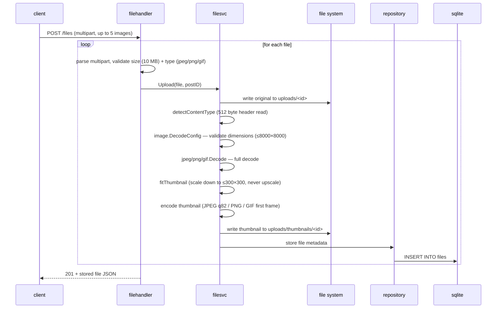
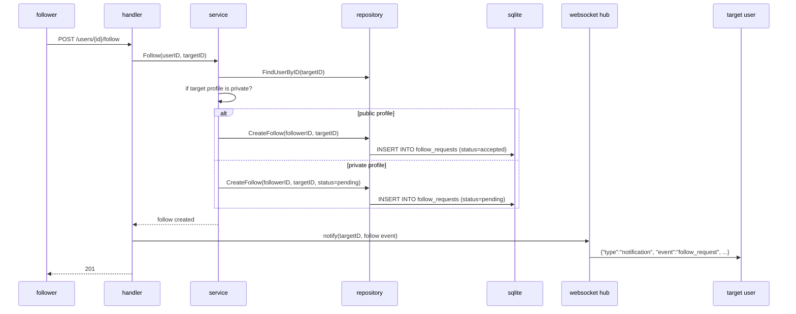
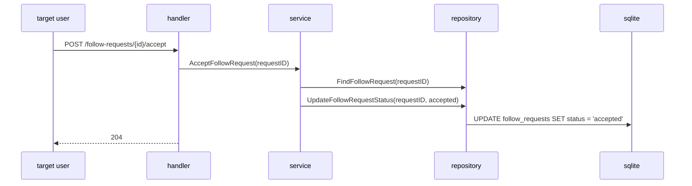
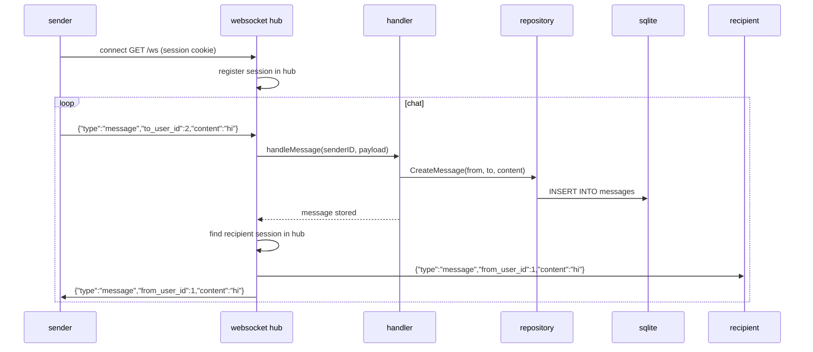
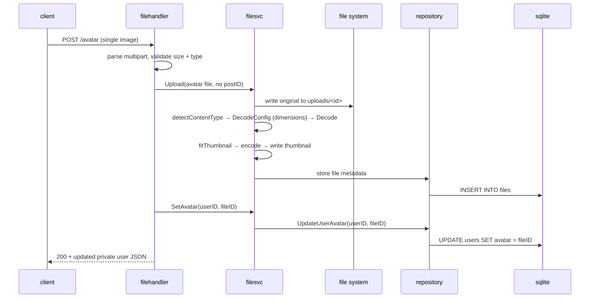

## INTRODUCTION
this is an api backend for our social network

## how to run
go run ./cmd/server
the server listens on :8080
it creates a sqlite database (sn.db) in the working directory and runs the embedded sql migrations automatically

## endpoints (/api/v*/ prefix shall be added using caddy)
/register and /login are guest only (logged in users get rejected), everything else needs a session cookie

### auth
| method | path | request | response |
|---|---|---|---|
| POST | /register | form: email, password, first_name, last_name, date_of_birth, nickname, about_me, avatar | 201 + private user json, logs you in right away |
| POST | /login | form: email, password | 200 + private user json |
| POST | /logout | - | deletes the session, clears the cookie and force closes that session's websockets |
| GET | /me | - | current user (private shape: adds email and date_of_birth to the public one) |

### users & follows
| method | path | request | response |
|---|---|---|---|
| GET | /users | - | not implemented yet (501) |
| GET | /user/{id} | - | public profile, 403 if the profile is private and you don't follow them |
| POST | /users/{id}/follow | - | follows the user, or creates a follow request if their profile is private |
| DELETE | /users/{id}/follow | - | unfollows |
| POST | /follow-requests/{id}/accept | - | 204 |
| POST | /follow-requests/{id}/decline | - | 204 |

### posts
| method | path | request | response |
|---|---|---|---|
| GET | /posts | - | posts visible to you (will add cursor pagination to it) |
| POST | /posts | form: content, privacy = public \| almost_private \| private | 201 + post json |
| PUT | /posts/{id} | form: content, privacy | 200 + post json, only the owner can update |
| DELETE | /posts/{id} | - | 204, only the owner can delete |

### files
| method | path | request | response |
|---|---|---|---|
| POST | /files | multipart: files[] or file (max 5 files, 10 MB each, jpeg/png/gif only), optional post_id to attach them to a post | 201 + stored file json |
| POST | /avatar | multipart: avatar (single image, same type/size limits) | 200 + private user json, sets your avatar |
| GET | /fs/{id} | - | serves the original file after a per user visibility check, 404 if you can't see it |
| GET | /fs/{id}/thumb | - | serves the pre-generated thumbnail (max 300x300) with long lived cache headers, 404 if you can't see the file or no thumbnail exists |

thumbnails are generated once during upload and stored next to the originals under uploads/thumbnails/, never resized per request
images are validated for dimensions (max 8000x8000) before full decode to prevent memory exhaustion; the existing 10 MB upload size limit is unchanged
animated gifs get a static first frame thumbnail; images smaller than 300x300 are kept as-is; uploads made before thumbnails existed return 404

### websocket
| method | path | request | response |
|---|---|---|---|
| GET | /ws | upgrade | chat + notifications over one socket (gorilla/websocket) |

client sends {"type":"message", "to_user_id" or "group_id", "content"} (exactly one target)
server sends back messages (echoed to the sender too), {"type":"notification", ...} events and {"type":"error", ...} for rejected input

## auth
cookie sessions, no jwt
a random 32 byte token stored in the sessions table with a 30 day expiry
cookie name is "session" (HttpOnly, SameSite=Lax)
passwords hashed with bcrypt

## rate limiting
every request goes through a per ip limiter: 100 requests per minute (sliding window), 429 with Retry-After when exceeded

## database
sqlite (WAL mode, foreign keys on)
migrations are embedded with go:embed and run at startup using golang-migrate (internal/db/migrations/sqlite)
tables: users, sessions, posts, follow_requests, groups, group_members, group_invitations, group_join_requests, group events, notifications, messages (private + group), reactions, files

## architecture
we are using a layered architecture
(model, middleware, handler, websocket, service, repository, db)

request flow: middleware -> handler -> service -> repository -> sqlite
the websocket hub sits next to that stack and talks to the repository directly

## sequence diagrams

### login

```mermaid
sequenceDiagram
    participant C as client
    participant MW as middleware
    participant H as handler
    participant S as service
    participant R as repository
    participant DB as sqlite

    C->>MW: POST /login (email, password)
    MW->>MW: rate limit check (per IP)
    MW->>H: forward request
    H->>S: FindUserByEmail(email)
    S->>R: FindUserByEmail(email)
    R->>DB: SELECT * FROM users WHERE email = ?
    DB-->>R: user row
    R-->>S: user
    S->>S: bcrypt.CompareHashAndPassword
    S-->>H: user, err (auth success)
    H->>S: CreateSession(user.ID)
    S->>R: CreateSession(token, userID, expiry)
    R->>DB: INSERT INTO sessions
    H->>C: 200 + Set-Cookie: session=token; HttpOnly; SameSite=Lax
```

### file upload + thumbnail generation



### follow request flow



### accept / decline follow request



### websocket messaging



### avatar upload


