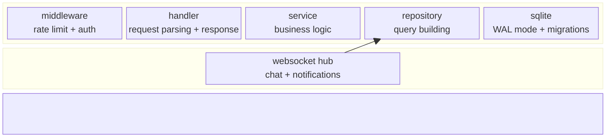
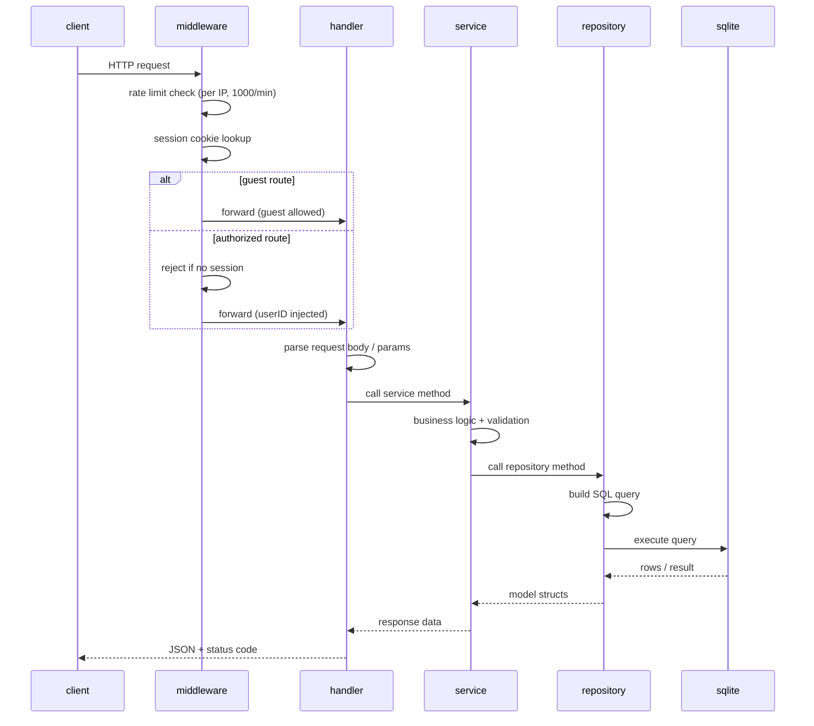
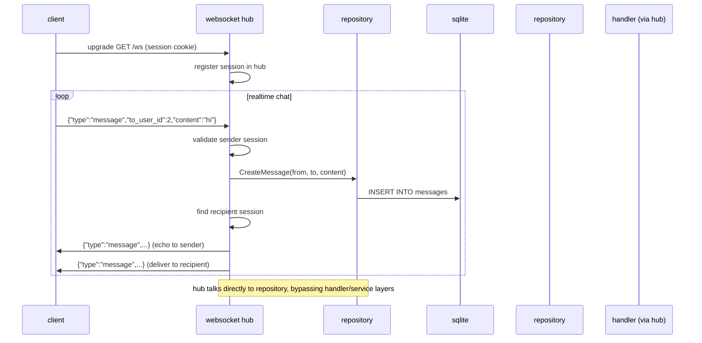
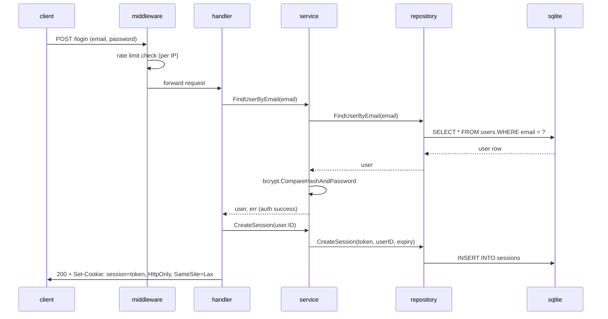
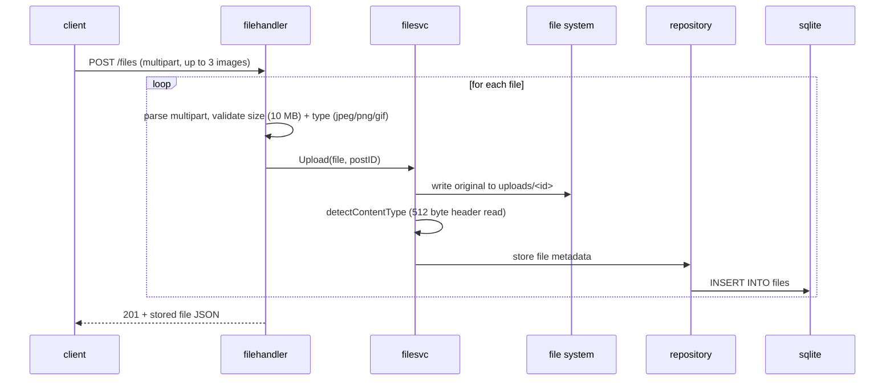
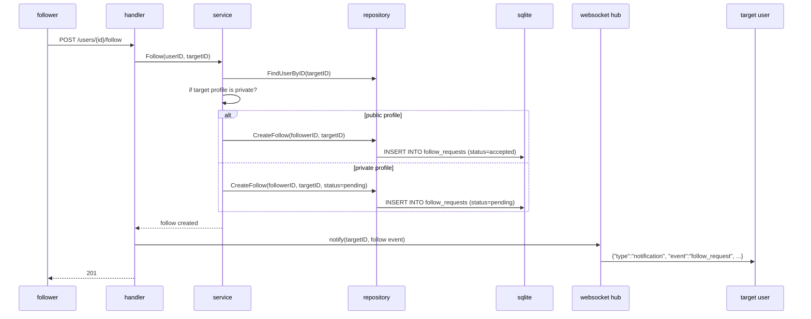
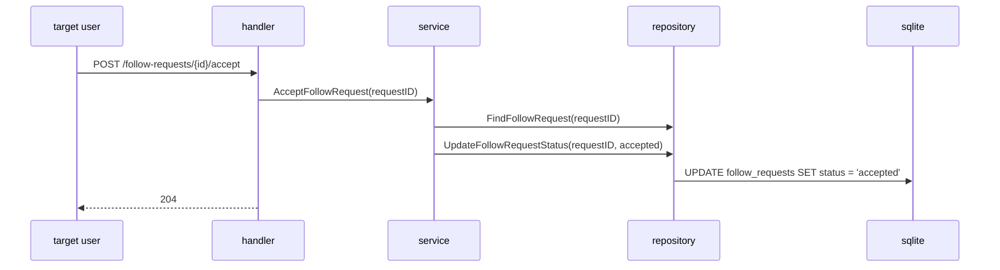
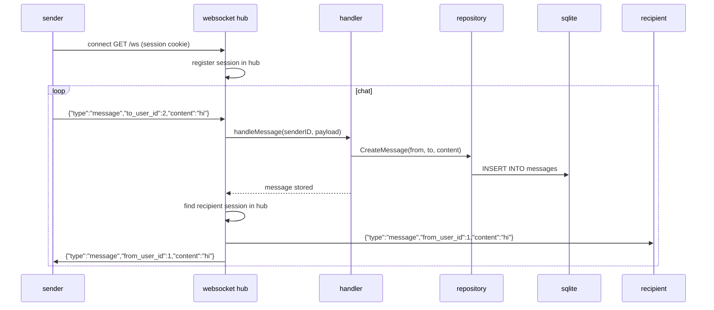
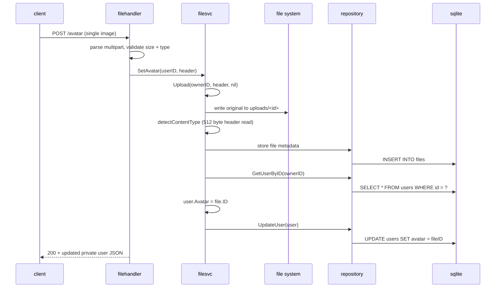

## INTRODUCTION
this is an api backend for our social network

## how to run
go run ./cmd/server
the server listens on :8080
it creates a sqlite database (sn.db) in the working directory and runs the embedded sql migrations automatically

## endpoints (/api/v*/ prefix shall be added using caddy)
/register and /login are guest only (logged in users get rejected), everything else needs a session cookie

### auth
| method | path | request | response |
|---|---|---|---|
| POST | /register | form: email, password, first_name, last_name, date_of_birth, nickname, about_me, avatar | 201 + private user json, logs you in right away |
| POST | /login | form: email, password | 200 + private user json |
| POST | /logout | - | deletes the session, clears the cookie and force closes that session's websockets |
| GET | /me | - | current user (private shape: adds email and date_of_birth to the public one) |

### users & follows
| method | path | request | response |
|---|---|---|---|
| GET | /users | - | not implemented yet (501) |
| GET | /user/{id} | - | public profile, 403 if the profile is private and you don't follow them |
| POST | /users/{id}/follow | - | follows the user, or creates a follow request if their profile is private |
| DELETE | /users/{id}/follow | - | unfollows |
| POST | /follow-requests/{id}/accept | - | 204 |
| POST | /follow-requests/{id}/decline | - | 204 |

### posts
| method | path | request | response |
|---|---|---|---|
| GET | /posts | - | posts visible to you (will add cursor pagination to it) |
| POST | /posts | form: content, privacy = public \| almost_private \| private | 201 + post json |
| PUT | /posts/{id} | form: content, privacy | 200 + post json, only the owner can update |
| DELETE | /posts/{id} | - | 204, only the owner can delete |
| POST | /posts/{id}/reactions | form: reaction = like \| dislike | 200 + summary, toggles: same reaction removes it, other switches; invisible post = 404 |
| DELETE | /posts/{id}/reactions | - | 200 + summary after removing your reaction |

Post json includes `likes`, `dislikes` (aggregate counts) and `my_reaction` (`like`, `dislike`, or empty) for the requesting user.

### groups
| method | path | request | response |
|---|---|---|---|
| POST | /groups | form: title, description | 201 + group json, creator joins the group automatically |
| GET | /groups | - | all groups with member_count, is_member, pending_join, is_creator for you |
| GET | /groups/{id} | - | group + creator + members + your status; only members/creators see detail, invited users get a flag, outsiders get 404 |
| GET | /groups/{id}/members | - | member list, members only (403 otherwise) |
| POST | /groups/{id}/invitations | form: user_id | 201 + invitation json, members only; rejects self-invites, unknown users, existing members and duplicates (409) |
| GET | /group-invitations | - | your pending invitations |
| POST | /group-invitations/{id}/accept | - | 204, recipient only, joins atomically |
| POST | /group-invitations/{id}/decline | - | 204, recipient only |
| POST | /groups/{id}/join-requests | - | 201 + request json, non-members only; members/duplicates rejected |
| GET | /groups/{id}/join-requests | - | pending requests, creator only |
| POST | /group-join-requests/{id}/accept | - | 204, group creator only, joins atomically |
| POST | /group-join-requests/{id}/decline | - | 204, group creator only |

Groups notifications (group_invitation, group_join_request, group_invite_response, group_join_response) are stored in the notifications table and pushed live over /ws with the standard `{"type":"notification", ...}` event.

### files
| method | path | request | response |
|---|---|---|---|
| POST | /files | multipart: files[] or file (max 3 files, 10 MB each, jpeg/png/gif only), optional post_id or message_id to attach them to a post or chat message | 201 + stored file json |
| POST | /avatar | multipart: avatar (single image, same type/size limits) | 200 + private user json, sets your avatar |
| GET | /fs/{id} | - | serves the original file after a per user visibility check, 404 if you can't see it; `Cache-Control: private, max-age=31536000, immutable` (files are immutable content-addressed IDs, so browsers may cache privately) |

### websocket
| method | path | request | response |
|---|---|---|---|
| GET | /ws | upgrade | chat + notifications over one socket (gorilla/websocket) |

client sends {"type":"message", "to_user_id" or "group_id", "content"} (exactly one target)
server sends back messages (echoed to the sender too), {"type":"notification", ...} events and {"type":"error", ...} for rejected input

## auth
cookie sessions, no jwt
a random 32 byte token stored in the sessions table with a 30 day expiry
cookie name is "session" (HttpOnly, SameSite=Lax)
passwords hashed with bcrypt

## rate limiting
every request goes through a per ip limiter: 1000 requests per minute (fixed window, matches `rateLimitRequests` and the `X-RateLimit-Limit` header), 429 with Retry-After when exceeded; idle windows are swept so the map cannot grow forever

## database
sqlite (WAL mode, foreign keys on)
migrations are embedded with go:embed and run at startup using golang-migrate (internal/db/migrations/sqlite)
tables: users, sessions, posts, follow_requests, groups, group_members, group_invitations, group_join_requests, group events, notifications, messages (private + group), reactions, files

## architecture
we are using a layered architecture
(model, middleware, handler, websocket, service, repository, db)

request flow: middleware -> handler -> service -> repository -> sqlite
the websocket hub sits next to that stack and talks to the repository directly

## sequence diagrams

### login

Client authenticates with email/password. The middleware checks rate limits, the handler looks up the user, the service verifies the bcrypt hash, and a session cookie is set on success.

### file upload

Client uploads up to 3 images (max 10 MB each). The service sniffs the content type, writes the original to disk, and stores the file metadata in the database.

### follow request flow

A user follows another user. If the target's profile is public, the follow is accepted immediately. If private, a pending follow request is created and the target user receives a real-time WebSocket notification.

### accept / decline follow request

The target user reviews a pending follow request and accepts or declines it. The repository updates the status in the `follow_requests` table.

### websocket messaging

Clients connect via WebSocket with a session cookie. The hub registers each session and routes messages directly through the repository, bypassing the handler/service layers. Messages are persisted and delivered to both the sender and recipient in real time.

### avatar upload

Client uploads a single image for their avatar. The service follows the same pipeline as post image uploads — sniffing the content type and writing the original to disk — then updates the `users.avatar` field to point to the new file.

